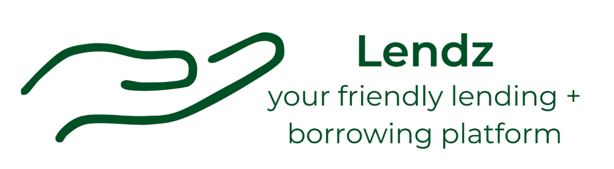

# Lendz - Full Stack Application

### Getting started - Set up

This project will soon be hosted on render.com. In the meantime, Lendz can be run by starting up the server with `$ python server.app.py` and starting the front end with `$ npm start --prefix client`.

### Description

Watch a full video demo [here](https://www.youtube.com/watch?v=H13HfGhHK1o).

Lendz is a full-stack application using Python, Flask, SQLAlchemy, Postgresql, JavaScript, and React. Inspired by my local buy nothing groups, users are able to create accounts, post listings to lend, claim others' listings (like comments), and rate each other. A Flask API is used to link the React front end with the backend data.

#### Features

On initial load, users will be brought to the **login/signup** page. They can either log in to an existing account or sign up for a new one, which commits a user to the Postgresql database. All forms use Formik and Yup to validate user input before making database changes.

 

Once signed in, users can browse all listings on the **Home** page, view listings they have tried to claim on the **Your Claims** page, or view their posted listing on the **Your Listings** page. Listings will initially appear as previews with a photo, title, and zip code.

 

There is an additional collapsible form on the **Your Listings** allowing users to post their own listings.

 

Users can select listing previews to get a larger view of an individual listing. The single listing view displays additional information such as meeting place, owner's username, and description. This view also gives the user the ability to claim or modify the listing (respective of whether or not they are the listing owner).

 

As a listing owner, you have the ability to select a claim to proceed with and rate the other user from the interaction. In turn, this gives the claimed-user an opportunity to rate the listing owner. User ratings are aggregated on the front end and displayed next to their usernames.

 

Lastly, users can log out and be navigated back to the sign in page.

### Backend Models

This project uses Flask-SQLAlchemy to create 3 related models: `User`, `Listing`, and `Claim`. `Claim`s are related to `Listing`s and `User`s through one-to-many relationships. `User`s and `Listing`s have a many-to-many relationship through `Claim`s, where each `User` can have many claimed `Listing`s and each `Listing` can have many claimed `User`s.
